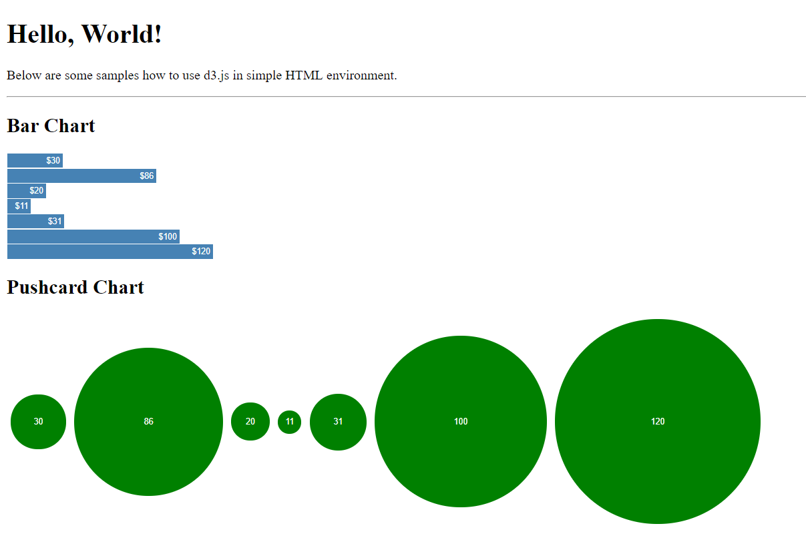

# D3-HTML-Tutorial



This repository is intended to showcase how to implement d3js to make various chart.

# Usage

```bash
$ git clone https://github.com/yabesWirawan/d3-html-tutorial.git
$ cd d3-html-tutorial-master
```

Open the index.html to preview it in the browser. Meanwhile, you can edit the d3 script in app.js.